  

  

  

### Selected work

Tools for reading, getting around, and exploring ideas on the web.

- **[Bindery](https://github.com/saam-rk/Bindery)** — Local document-to-EPUB conversion for Kindle, with Windows OCR and optional, reviewable AI cleanup. `Python · FastAPI`
- **[SomnoRoute](https://github.com/saam-rk/SomnoRoute)** — Android proximity alarms for public-transport journeys. `Java · Android`
- **[SWODS](https://github.com/saam-rk/swods-erasmus-photo-experience)** — Multilingual collaborative photography prototype for an Erasmus+ experience. Source-only; not piloted or production-ready. `TypeScript · Next.js`

  

[GitHub](https://github.com/saam-rk) · [Repositories](https://github.com/saam-rk?tab=repositories) · [Activity](https://github.com/saam-rk?tab=overview)

Self-contained SVGs, generated with Python. [Data & customization](CUSTOMIZE.md).
